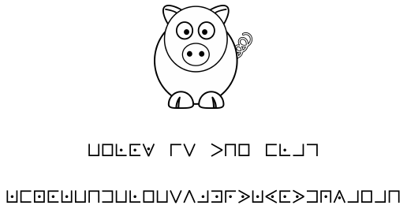

+++
date = '2026-03-26T20:01:07+01:00'
draft = false
title = 'Crayon_cochon'
+++

## Attachments

Note : Le flag ne suit aucun format de flag.

Cette épreuve avait été proposée lors de l’entrainement de la Team France en septembre 2019.

## Reverse

Nothing interesting, neither with exiftool, strings, file or whatever.
We need to decode the weird string on the photo but how ...?
Let's map the string

<table style="border-collapse: collapse; font-family: monospace;">
<tr>U        => A</tr> 
<tr>O        => B</tr> 
<tr>L.       => C</tr> 
<tr>C.       => D</tr> 
<tr>V.       => E</tr> 
<tr></tr> 
<tr>r        => F</tr> 
<tr>V        => G</tr> 
<tr></tr> 
<tr>p        => H</tr> 
<tr>n        => I</tr> 
<tr>O        => B</tr> 
<tr></tr> 
<tr>C        => J</tr> 
<tr>L.       => C</tr> 
<tr>Linv     => K</tr> 
<tr>rinv     => L</tr> 
<tr></tr> 
<tr>U.       => M</tr> 
<tr>C        => J</tr> 
<tr>O.       => N</tr> 
<tr>C.       => D</tr> 
<tr>U.       => M</tr> 
<tr>U        => A</tr> 
<tr>n        => I</tr> 
<tr>Cinv     => O</tr> 
<tr>U        => A</tr> 
<tr>L.       => C</tr> 
<tr>O        => B</tr> 
<tr>U        => A</tr> 
<tr>V        => G</tr> 
<tr>A        => P</tr> 
<tr>Linv.    => Q</tr> 
<tr>Cinv.    => R</tr> 
<tr>r.       => S</tr> 
<tr>p.       => T</tr> 
<tr>U.       => M</tr> 
<tr>pinv.    => U</tr> 
<tr>C.       => D</tr> 
<tr>p.       => T</tr> 
<tr>Cinv     => O</tr> 
<tr>n.       => V</tr> 
<tr>A.       => W</tr> 
<tr>Linv     => K</tr> 
<tr>O        => B</tr> 
<tr>Linv     => K</tr> 
<tr>n        => I</tr> 

</table>

S = "ABCDE FG HIB JCKL MJNDMAIOACBAGPQRSTMUDTOVWKBKI"

As the description says, the flag hasn't particular format so it's impossible to bruteforce a mono-alphabetic substitution.

After searching the web, it's a "cipher" known under the name "Chiffre des francs-maçons" and the substitution is as follow:

## Solve
"BELOW IS THE FLAG KFNOKBHDBLEBSVJMRXKYOXDQZAEAH"

Maybe sometimes the best thing to do is to directly search on internet.. or request an AI.

Thx.

Sk4r.