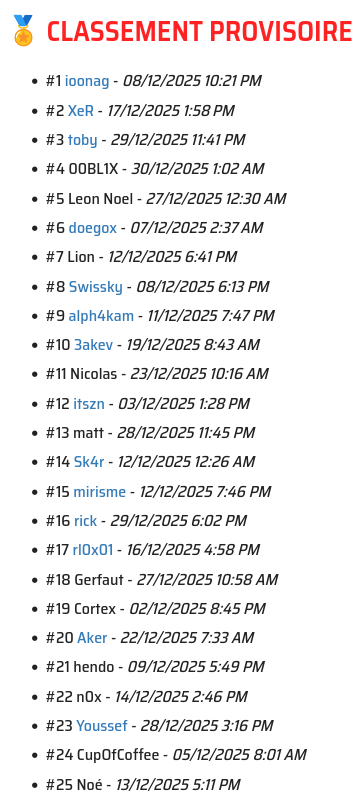
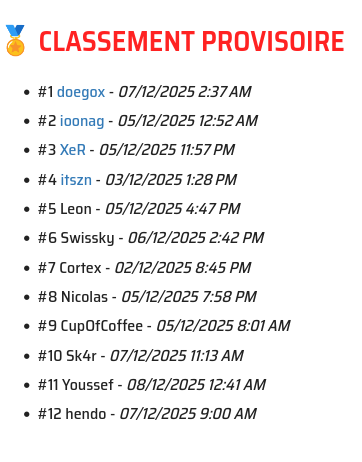
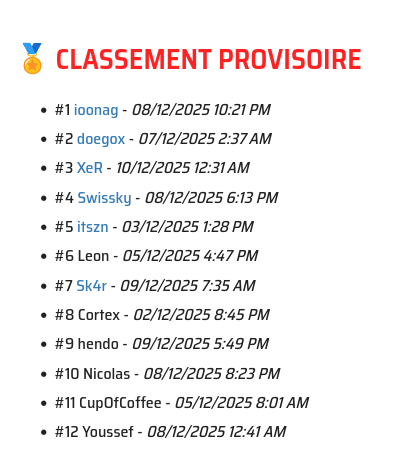

+++
date = '2026-01-20T18:08:00+01:00'
draft = false
title = 'Challenge Synacktiv Winter 2025'
+++


<br>
Synacktiv invite us to construct a binary following some rules, this binary must
    <ol>
        <li>be a palindrome</li>
        <li>print himself</li>
        <li>be size minimal</li>
    </ol>

## TL; DR;
<br>
The binary must pass the check:<br>
<a href="/notes/chall_syn_h2025/check.sh">check.sh</a><br>
and mine is here:<br>
<a href="/notes/chall_syn_h2025/elf">elf</a>


```bash
└─$ xxd ../elf
00000000: 7f45 4c46 0100 0000 0000 0000 0000 0100  .ELF............
00000010: 0200 0300 ffff 0000 2000 0100 0400 0000  ........ .......
00000020: b580 01c9 b004 eb06 2c00 2000 0100 43b2  ........,. ...C.
00000030: 6fcd 804b b001 cd80 cd01 b04b 80cd 6fb2  o..K.......K..o.
00000040: 4300 0100 2000 2c06 eb04 b0c9 0180 b500  C... .,.........
00000050: 0000 0400 0100 2000 00ff ff00 0300 0200  ...... .........
00000060: 0100 0000 0000 0000 0000 0146 4c45 7f    ...........FLE.
```
Surprisingly, the ElfHeader contains its own size, allowing it to be truncated while still remaining valid.<br>
It also contains the address of the program header, allowing us to choose where to place it and thus overlap these two structures.<br>

This way, only these two header parts can be kept:

- `Elf32_Ehdr` (offset 0x00 à 0x2c), up to e_phentsize
- `Elf32_Phdr` (offset 0x04 à 0x20), with only p_align truncated

truncated headers :
```C
typedef struct {
    unsigned char e_ident[16];  
    uint16_t      e_type;    
    uint16_t      e_machine; 
    uint32_t      e_version;  
    uint32_t      e_entry;  // Entry point at 0x18 = 0x00010020
    uint32_t      e_phoff;  // Program Header at 0x1c = 0x04
    uint32_t      e_shoff;    
    uint32_t      e_flags; 
    uint16_t      e_ehsize; // Size of ELF Header
    uint16_t      e_phentsize;
} Elf32_Ehdr;

typedef struct {
    uint32_t p_type; 
    uint32_t p_offset; 
    uint32_t p_vaddr;       // Load adress at 0x0c = 0x00010000
    uint32_t p_paddr;  
    uint32_t p_filesz; 
    uint32_t p_memsz;  
    uint32_t p_flags;  
} Elf32_Phdr;
```
After nesting the headers inside one another,
we can modify the “unused” header fields by inserting our code into them.

```
1) The kernel parses the ELF header
2) Thanks to the ELF header, it knows where to find the program header,
   which it also parses
3) If there is no error, it loads the program at 0x10000 as specified by
   `Elf32_Phdr->p_vaddr` at 0x0c
4) It checks the entry point and executes the first instruction at 0x20
5) b580 = mov $0x80, %ch     (ecx = 0x8000)
6) 01c9 = add %ecx, %ecx     (ecx = 0x10000) 
7) b004 = mov $0x4, %al      (eax = 4)    (write syscall)
8) eb06 = jump + 6           (eip = 0x2e)
9) 43 = inc %ebx             (ebx = 1)    (stdout)
10) b26f = mov $0x6f, %dl    (edx = 0x6f) (binary size)
11) cd80 = int $0x80         (syscall write(1, 0x10000, 0x6f))
12) 4b = dec %ebx            (ebx = 0)
13) b001 = mov $1, %al       (eax = 1)
14) cd80 = int $0x80         (syscall exit(0))
```

Résultat :

```bash
└─$ ../check.sh ../elf
[+] First check passed: binary is a byte-wise palindrome.
[+] Second check passed: binary is a true quine, its output matches itself.
[+] Both checks passed: your binary is a very nice quinindrome!
[+] Your score: 111
```



Many thanks to <a href="https://www.synacktiv.com"><strong>Synacktiv</strong></a> for organizing this challenge.
Congratulations to all the participants, and especially to <a href="https://github.com/fishilico"><strong>ioonag</strong></a> for their 81-byte solution.

<br>

## Explanation

### First attempt 
<br>
Naively, for a first draft:

- For the palindrome, we can simply copy and paste the binary in “mirror” form → abcd → abcddcba
- To reduce the size, we’ll write it in assembly
- And for the self-printing part, we’ll just implement it ourselves

With two preliminary choices nonetheless: PIE is better for knowing what to print, and using 32-bit will probably take less space.

```asm
.text

.globl _start

_start:
    mov $0x08048000, %ecx
    inc %ebx
    mov $0x22e0, %edx
    mov $0x4, %eax
    int $0x80
    dec %ebx
    mov $0x1, %eax
    int $0x80
```

```python
f = open("./elf", "rb")
d = f.read()
f.close()

r = open("./elf2", "wb+")
r.write(d)
for i in range(len(d)):
    r.write(d[-i-1].to_bytes())
r.close()
```

Already, the first problem:
our binary is quite large.

```bash
00000000: 7f45 4c46 0101 0100 0000 0000 0000 0000  .ELF............
00000010: 0200 0300 0100 0000 0090 0408 3400 0000  ............4...
00000020: a810 0000 0000 0000 3400 2000 0200 2800  ........4. ...(.
00000030: 0500 0400 0100 0000 0000 0000 0080 0408  ................
00000040: 0080 0408 7400 0000 7400 0000 0400 0000  ....t...t.......
00000050: 0010 0000 0100 0000 0010 0000 0090 0408  ................
...
00002280: 0804 9000 0000 1000 0000 0001 0000 1000  ................
00002290: 0000 0004 0000 0074 0000 0074 0804 8000  .......t...t....
000022a0: 0804 8000 0000 0000 0000 0001 0004 0005  ................
000022b0: 0028 0002 0020 0034 0000 0000 0000 10a8  .(... .4........
000022c0: 0000 0034 0804 9000 0000 0001 0003 0002  ...4............
000022d0: 0000 0000 0000 0000 0001 0101 464c 457f  ............FLE.
```

And it contains a lot of unnecessary data (at least half of it).
So the kernel doesn’t bother loading everything:

```bash
(gdb) b *0
Breakpoint 1 at 0x0
(gdb) r
Starting program: /home/sk4r/GITHUB/Advent_2025/SYNAK/wu/elf2 
Warning:
Cannot insert breakpoint 1.
Cannot access memory at address 0x0

(gdb) info proc map
process 126990
Mapped address spaces:

Start Addr End Addr   Size       Offset     Perms File 
0x08048000 0x0804a000 0x2000     0x0        r-xp  /home/sk4r/GITHUB/Advent_2025/SYNACKTIV/wu/elf2 
0xf7ff6000 0xf7ffa000 0x4000     0x0        r--p  [vvar] 
0xf7ffa000 0xf7ffc000 0x2000     0x0        r--p  [vvar_vclock] 
0xf7ffc000 0xf7ffe000 0x2000     0x0        r-xp  [vdso] 
0xfffdc000 0xffffe000 0x22000    0x0        rwxp  [stack] 
```

Not everything is loaded → not everything is printable.
So this solution is dead.

### Second attempt
<br>
We’ll therefore directly modify the structures:

- handcrafted binary structure
- code payload artificially added
- and still a mirrored copy-paste for the palindrome rule

An ELF relies on two main structures to function
(I’m waiting for other write-ups, but I couldn’t get it working without these two).

```C
typedef struct {
    unsigned char e_ident[16]; /* ELF identification */
    uint16_t      e_type;      /* File type (REL, EXEC, DYN…) */
    uint16_t      e_machine;   /* Target architecture (e.g. EM_386) */
    uint32_t      e_version;   /* ELF version */
    uint32_t      e_entry;     /* Entry point address */
    uint32_t      e_phoff;     /* Offset of the program header table */
    uint32_t      e_shoff;     /* Offset of the section header table */
    uint32_t      e_flags;     /* Architecture-specific flags */
    uint16_t      e_ehsize;    /* Size of this ELF header */
    uint16_t      e_phentsize; /* Size of one program header entry */
    uint16_t      e_phnum;     /* Number of entries in the program header table */
    uint16_t      e_shentsize; /* Size of one section header entry */
    uint16_t      e_shnum;     /* Number of entries in the section header table */
    uint16_t      e_shstrndx;  /* Index of the section containing section names */
} Elf32_Ehdr;

typedef struct {
    uint32_t p_type;   /* Segment type (LOAD, DYNAMIC, INTERP, NOTE, etc.) */
    uint32_t p_offset; /* Segment offset in the file */
    uint32_t p_vaddr;  /* Virtual address where the segment must be loaded */
    uint32_t p_paddr;  /* Physical address (often ignored) */
    uint32_t p_filesz; /* Segment size in the file */
    uint32_t p_memsz;  /* Segment size in memory after loading */
    uint32_t p_flags;  /* Segment permissions (R, W, X) */
    uint32_t p_align;  /* Required segment alignment */
} Elf32_Phdr;
```

```python
from pwn import *


payload = b"\x90"*12 # for alignment
# non-optimized shellcode
payload += b"\xb9\x00\x80\x04\x08\x43\xba\xec\x00\x00\x00" 
payload += b"\x83\xc0\x04\xcd\x80\x4b\x31\xc0\x40\xcd\x80"

SIZE = len(payload)

''' struct Elf32_Ehdr '''
e_ident = b"\x7fELF\x01\x01\x01\x00" + b"\xff"*8
e_type = p16(2)
e_machine = p16(3)
e_version = p32(0xffffffff)
e_entry = p32(0x08048060) 
e_phoff = p32(0x34)  
e_shoff = p32(0xffffffff)  
e_flags = p32(0xffffffff)
e_ehsize = p16(0x34)        
e_phentsize = p16(0x20)    
e_phnum = p16(1)          
e_shentsize = p16(0x28)      
e_shnum = p16(0)          
e_shstrndx = p16(0)    


''' struct Elf32_Phdr '''

p_type = p32(1)
p_offset = p32(0x60)
p_vaddr = p32(0x08048060)
p_paddr = p32(0x08048060)
p_filesz = p32(SIZE)
p_memsz = p32(SIZE)
p_flags = p32(4)
p_align = p32(16)


def construct_elf_header(buf):
    buf += e_ident 
    buf += e_type 
    buf += e_machine 
    buf += e_version 
    buf += e_entry 
    buf += e_phoff 
    buf += e_shoff 
    buf += e_flags 
    buf += e_ehsize 
    buf += e_phentsize 
    buf += e_phnum 
    buf += e_shentsize 
    buf += e_shnum 
    buf += e_shstrndx 
    return buf

def construct_prog_header(buf):
    buf += p_type
    buf += p_offset
    buf += p_vaddr
    buf += p_paddr
    buf += p_filesz
    buf += p_memsz
    buf += p_flags
    buf += p_align
    return buf


b = open("./elf", "wb+")


bd = b""
bd = construct_elf_header(bd)
bd = construct_prog_header(bd)
bd += payload

b.write(bd)
for i in range(len(bd)):
    b.write(bd[-i-1].to_bytes())
b.close()
```

```bash
└─$ ./elf
ELF������������`4��������4 (```""�������������C����̀K1�@̀��@�1K�������������������"��``( 4���������`������������FLE   
```


```bash
└─$ ../check.sh ./elf
[+] First check passed: binary is a byte-wise palindrome.
[+] Second check passed: binary is a true quine, its output matches itself.
[+] Both checks passed: your binary is a very nice quinindrome!
[+] Your score: 236
```
Perfect, we get our first working binary.<br>
but <br>
...<br>
...



10 on 12, not really good.

Our binary actually looks like that:

```bash
└─$ xxd elf
00000000: 7f45 4c46 0101 0100 ffff ffff ffff ffff  .ELF............
00000010: 0200 0300 ffff ffff 6080 0408 3400 0000  ........`...4...
00000020: ffff ffff ffff ffff 3400 2000 0100 2800  ........4. ...(.
00000030: 0000 0000 0100 0000 6000 0000 6080 0408  ........`...`...
00000040: 6080 0408 2200 0000 2200 0000 0400 0000  `..."...".......
00000050: 1000 0000 9090 9090 9090 9090 9090 9090  ................
00000060: b900 8004 0843 baec 0000 0083 c004 cd80  .....C..........
00000070: 4b31 c040 cd80 80cd 40c0 314b 80cd 04c0  K1.@....@.1K....
00000080: 8300 0000 ecba 4308 0480 00b9 9090 9090  ......C.........
00000090: 9090 9090 9090 9090 0000 0010 0000 0004  ................
000000a0: 0000 0022 0000 0022 0804 8060 0804 8060  ..."..."...`...`
000000b0: 0000 0060 0000 0001 0000 0000 0028 0001  ...`.........(..
000000c0: 0020 0034 ffff ffff ffff ffff 0000 0034  . .4...........4
000000d0: 0804 8060 ffff ffff 0003 0002 ffff ffff  ...`............
000000e0: ffff ffff 0001 0101 464c 457f            ........FLE.
```

### First optimization
<br>
The \x90 bytes take up a lot of space, and our code does too in the end.
The first optimization I thought of was to put the code directly into the headers, since there are plenty of places that aren’t used. By changing the entry point and jumping from unused areas to other unused areas, there’s more than enough room for our code.


```bash
└─$ xxd /tmp/elf                  
00000000: 7f45 4c46 0101 0100 c1e1 1083 c004 eb10  .ELF............
00000010: 0200 0300 ffff ffff 5000 0100 2c00 0000  ........P...,...
00000020: cd80 4b31 c040 ebf8 2c00 2000 0100 0000  ..K1.@..,. .....
00000030: 5000 0000 5000 0100 ffff ffff 1000 0000  P...P...........
00000040: 1000 00ba a400 0000 4143 ebbc 9090 9090  ........AC......
00000050: ebf1 f1eb 9090 9090 bceb 4341 0000 00a4  ..........CA....
00000060: ba00 0010 0000 0010 ffff ffff 0001 0050  ...............P
00000070: 0000 0050 0000 0001 0020 002c f8eb 40c0  ...P..... .,..@.
00000080: 314b 80cd 0000 002c 0001 0050 ffff ffff  1K.....,...P....
00000090: 0003 0002 10eb 04c0 8310 e1c1 0001 0101  ................
000000a0: 464c 457f                                FLE.
```

```bash
└─$ xxd /tmp/elf32
00000000: 7f45 4c46 41c1 e110 4383 c004 b27d eb10  .ELFA...C....}..
00000010: 0200 0300 1000 0000 0400 0100 2c00 0000  ............,...
00000020: cd80 4b31 c040 cd80 2c00 2000 0100 0000  ..K1.@..,. .....
00000030: 5400 0000 5400 0100 0f0f 0f0f 0f0f 0f0f  T...T...........
00000040: 0f0f 0f0f 0f00 0100 5400 0000 5400 0000  ........T...T...
00000050: 0100 2000 2c80 cd40 c031 4b80 cd00 0000  .. .,..@.1K.....
00000060: 2c00 0100 0400 0000 1000 0300 0210 eb7d  ,..............}
00000070: b204 c083 4310 e1c1 4146 4c45 7f         ....C...AFLE.
```


```bash
└─$ ../check.sh ./elf
[+] First check passed: binary is a byte-wise palindrome.
[+] Second check passed: binary is a true quine, its output matches itself.
[+] Both checks passed: your binary is a very nice quinindrome!
[+] Your score: 125
```



7 on 12, much better but i hope we could do more.


### Header overlapping
<br>

Finally i think about a last but surelly the best way to optimize the size, overlap the headers.<br>
As the Elf32_Ehdr->e_phoff points to the first program header, we can make it point inside the Elf32_Ehdr itself.<br>
As These two headers need to be valid as well, there is not a lot of place where we can put the Elf32_Phdr, i choose to put it at offest 0x4.
Finally we must adjust our code to go in new unused space, and also try to shrink as must as possible the mirror impact.


```bash
└─$ xxd /tmp/elf33
00000000: 7f45 4c46 0100 0000 0000 0000 0000 0100  .ELF............
00000010: 0200 0300 ff00 0000 2000 0100 0400 0000  ........ .......
00000020: 4183 c004 b274 eb06 3400 2000 0100 43c1  A....t..4. ...C.
00000030: e110 cd80 31c0 4b40 cd80 80cd 404b c031  ....1.K@....@K.1
00000040: 80cd 10e1 c143 0001 0020 0034 06eb 74b2  .....C... .4..t.
00000050: 04c0 8341 0000 0004 0001 0020 0000 00ff  ...A....... ....
00000060: 0003 0002 0001 0000 0000 0000 0000 0001  ................
00000070: 464c 457f                                FLE.
```

```bash
└─$ xxd /tmp/elf34
00000000: 7f45 4c46 0100 0000 0000 0000 0000 0100  .ELF............
00000010: 0200 0300 ffff 0000 2000 0100 0400 0000  ........ .......
00000020: b580 01c9 b004 eb06 2c00 2000 0100 43b2  ........,. ...C.
00000030: 6fcd 804b b001 cd80 cd01 b04b 80cd 6fb2  o..K.......K..o.
00000040: 4300 0100 2000 2c06 eb04 b0c9 0180 b500  C... .,.........
00000050: 0000 0400 0100 2000 00ff ff00 0300 0200  ...... .........
00000060: 0100 0000 0000 0000 0000 0146 4c45 7f    ...........FLE.
```

```bash
└─$ ../check.sh ./elf
[+] First check passed: binary is a byte-wise palindrome.
[+] Second check passed: binary is a true quine, its output matches itself.
[+] Both checks passed: your binary is a very nice quinindrome!
[+] Your score: 111
```


A lot of new player finally join the callenge, I don't really see how i can do a better solution.
I finally finish 14 over 25 and i'm press to see other solution.

Thx.<br>
Sk4r.
